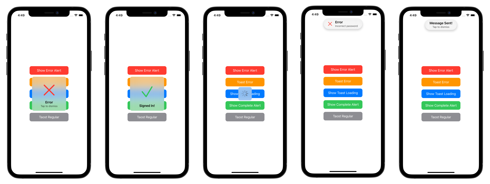
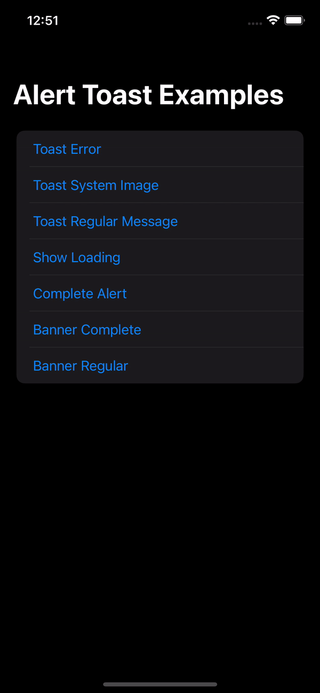

# AlertToast


Present Apple-like alert & toast in SwiftUI



## Overview



Currently in SwiftUI, the only way to inform the user about some process that finished for example, is by using `Alert`. Sometimes, you just want to pop a message that tells the user that something completed, or his message was sent. Apple doesn't provide any other method rather than using `Alert` even though Apple using all kinds of different pop-ups. The results are poor UX where the user would need to tap "OK/Dismiss" for every little information that he should be notified about.

Alert Toast is an open-source library in Github to use with SwiftUI. It allows you to present popups that don't need any user action to dismiss or to validate. Some great usage examples: `Message Sent`, `Poor Network Connection`, `Profile Updated`, `Logged In/Out`, `Favorited`, `Loading` and so on...

* Built with pure SwiftUI.
* 3 Display modes: `Alert` (pop at the center), `HUD` (drop from the top) and `Banner` (pop/slide from the bottom).
* `Complete`, `Error` `SystemImage`, `Image`, `Loading`, and `Regular` (Only Text).
* Supports Light & Dark Mode.
* Works with **any** kind of view builder.
* Localization support.
* Font & Background customization.

## Table of contents

* [Requirements](#requirements)
* [Installation](#installation)
* [Usage](#usage)
    * [Quick start](#quick-start)
    * [Customization](#customization)
* [Acknowledgements](#acknowledgements)
* [License](#license)

## Requirements

- SwiftUI
- iOS 15.0+, macCatalyst 15.0+, macOS 12.0+, tvOS 15.0+, visionOS 1.0+

## Installation

### Swift Package Manager

The [Swift Package Manager](https://swift.org/package-manager/) is a tool for managing the distribution of Swift code. It’s integrated with the Swift build system to automate the process of downloading, compiling, and linking dependencies.

**AlertToast** could be installed via [Swift Package Manager](https://www.swift.org/package-manager/). Open Xcode and go to **File** -> **Add Packages...**, search `https://github.com/hengyu/AlertToast.git`, and add the package as one of your project's dependency.

### Manually

If you prefer not to use any of dependency managers, you can integrate **AlertToast** into your project manually. Put `Sources/AlertToast` folder in your Xcode project. Make sure to enable `Copy items if needed` and `Create groups`.

## Usage

### Quick start

First, add `import AlertToast` on every `swift` file you would like to use `AlertToast`.

Then, use the `.toast` view modifier:

**Parameters:**

Method 1.

- `isPresenting`: (MUST) assign a `Binding<Bool>` to show or dismiss alert.
- `duration`: default is 1.2, set 0 to disable auto dismiss.
- `tapToDismiss`: default is `true`, set `false` to disable.
- `displayMode`: Should be either `.alert`, `.hud`, or `.banner(BannerAnimation)`.
- `alert`: A SwiftUI View, can be `AlertToast`.

Method 2.

- `item`: (MUST) assign a `Binding<Item?>` to show or dismiss alert.
- `duration`: default is 1.2, set 0 to disable auto dismiss.
- `displayMode`: Should be either `.alert`, `.hud`, or `.banner(BannerAnimation)`.
- `alert`: A SwiftUI View, can be `AlertToast`.

#### Usage example with regular alert

```swift 
import AlertToast
import SwiftUI

struct ContentView: View{

    @State private var showToast = false

    var body: some View{
        VStack{
            Button("Show Toast"){
                 showToast.toggle()
            }
        }
        .toast(isPresenting: $showToast, displayMode: .alert) {

            // Set shape to `.square` to draw a square view with title
            AlertToast(type: .regular, title: "Message Sent!", shape: .square)
            
            // Set shape to `.pill` to draw a pill like view with title, usually works
            // with displayMode `.hud`.
//          AlertToast(type: .regular, title: "Message Sent!", shape: .pill)
            
            // Set shape to `.banner` to draw a banner view with title, usually works
            // with displayMode `.banner(BannerTransition)`.
//          AlertToast(type: .regular, title: "Message Sent!", shape: .banner)
        }
    }
}
```

#### Complete modifier example

```swift
.toast(isPresenting: $showAlert, duration: 1.2, tapToDismiss: true, alert: {
   //AlertToast goes here
}, onTap: {
   //onTap would call either if `tapToDismis` is true/false
   //If tapToDismiss is true, onTap would call and then dismis the alert
}, completion: {
   //Completion block after dismiss
})
```

### Customization

```swift
AlertToast(
    type: AlertType,
    title: Optional(String),
    subtitle: Optional(String),
    style: AlertStyle
)
           
//This is the available customizations parameters:
AlertStyle(
    alertShape: AlertShape,
    titleStyle: ShapeStyle,
    titleFont: Font,
    subtitleStyle: ShapeStyle,
    subtitleFont: Font,
    background: ShapeStyle
)
```

#### Available alert types:

- **Regular:** text only (Title and Subtitle).
- **Complete:** animated checkmark.
- **Error:** animated xmark.
- **System Image:** name image from `SFSymbols`.
- **Image:** name image from Assets.
- **Loading:** Activity Indicator (Spinner).

#### Alert dialog view modifier (with default settings):
```swift
.toast(isPresenting: Binding<Bool>, duration: Double = 1.2, tapToDismiss: true, alert: () -> AlertToast , onTap: () -> (), completion: () -> () )
```

#### Simple Text Alert:
```swift
AlertToast(type: .regular, title: Optional(String), subtitle: Optional(String), style: AlertStyle)
```

#### Complete/Error Alert:
```swift
AlertToast(type: .complete(Color)/.error(Color), title: Optional(String), subtitle: Optional(String), style: AlertStyle)
```

#### System Image Alert:
```swift
AlertToast(type: .systemImage(String, Color), title: Optional(String), subtitle: Optional(String), style: AlertStyle)
```

#### Image Alert:
```swift
AlertToast(type: .image(String), title: Optional(String), subtitle: Optional(String), style: AlertStyle)
```

#### Loading Alert:
```swift
// When using loading, duration won't auto dismiss and tapToDismiss is set to false
AlertToast(type: .loading, title: Optional(String), subtitle: Optional(String), style: AlertStyle)
```

You can add many `.toast` on a single view.

## Acknowledgements

**AlertToast** is originated from the [AlertToast](https://github.com/elai950/AlertToast) created by [Elai Zuberman](https://github.com/elai950). We have made several updates based on the original work. And we want to express our heartful appreciation to the creator and contributers of original **AlertToast**.

## 📃 License

**AlertToast** is under the terms and conditions of the [MIT license](LICENSE).
